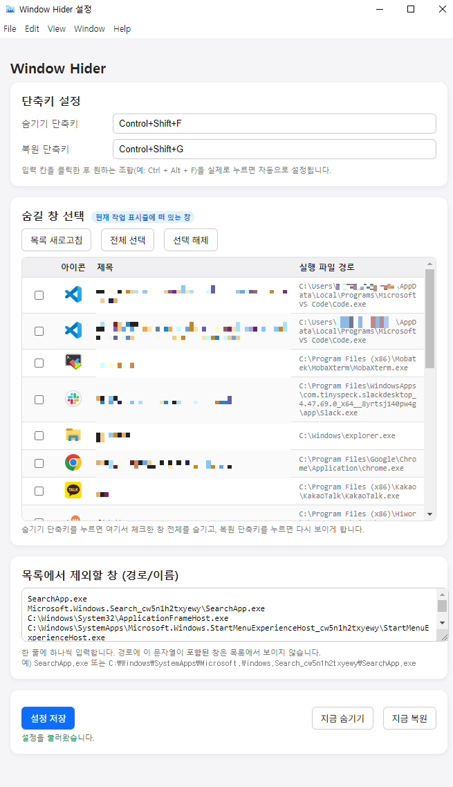

# Window Hider
Windows에서 선택한 창을 **단축키로 숨기고 / 복원**할 수 있는 간단한 유틸리티  
숨길 창을 체크한 뒤 단축키를 누르면 해당 창이 화면에서 완전히 사라지고,
복원 단축키를 누르면 다시 원래 상태로 돌아옴.

또한 프로그램 자체는 최소화하면 **트레이 아이콘으로만 남도록** 작동  

---

## 주요 기능

* 선택한 창 숨기기 / 복원
* 사용자 정의 단축키
* 자동 설정 저장
* 제외 목록(표시하지 않을 창) 관리
* 트레이 아이콘 지원
* 종료 시 숨겨진 창 자동 복원

---

## 실행 방법

1. 프로젝트 설치

   ```
   npm install
   ```

2. 실행

   ```
   npm start
   ```

3. 숨길 창을 체크하고 단축키를 설정하면 바로 사용 가능합니다.

---

## 실행결과

